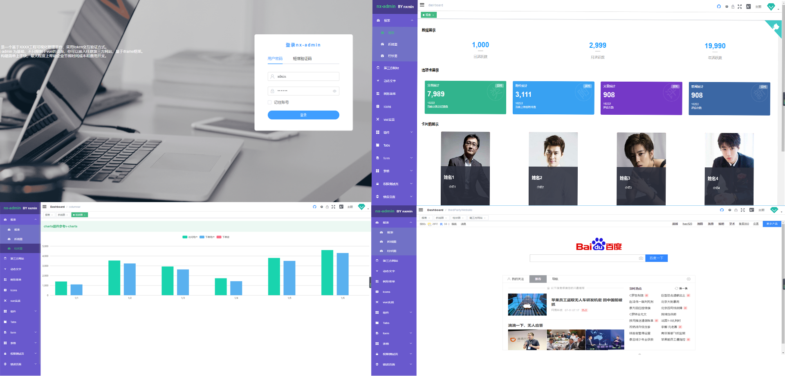

<p align="center">
  
</p>

<p align="center">
  <a href="https://github.com/vuejs/vue">
    
  </a>
  <a href="https://github.com/ElemeFE/element">
    
  </a>
   <a href="https://travis-ci.org/mgbq/nx-admin" rel="nofollow">
    
  </a>
    <a href="https://github.com/mgbq/nx-admin/blob/master/LICENSE">
    
  </a>
  <a href="https://github.com/mgbq/nx-admin/releases">
    
  </a>
  
  > ## :gem: Vue自动化管理系统
</p>

简体中文 | [English](./README.en.md)

## 介绍

[nx-admin](https://mgbq.github.io/vue-permission/#/login) 是一个开源的管理系统前端集成方案，它基于 [vue](https://github.com/vuejs/vue) 和 [element](https://github.com/ElemeFE/element)。它使用了最新的前端技术栈，内置了 i18 国际化解决方案，动态路由，权限验证，提炼了典型的业务模型，提供了丰富的功能组件，它可以帮助你快速搭建企业级中后台产品原型。最大程度上帮助个人，企业节省时间成本和费用开支。

[中文文档](https://mgbq.github.io/nx-admin-site/zh/)



## 前序准备

你需要在本地安装 [node](http://nodejs.org/) 和 [git](https://git-scm.com/)。本项目技术栈基于 [ES2015+](http://es6.ruanyifeng.com/)、[vue](https://cn.vuejs.org/index.html)、[vuex](https://vuex.vuejs.org/zh-cn/)、[vue-router](https://router.vuejs.org/zh-cn/) 、[axios](https://github.com/axios/axios) 和 [element-ui](https://github.com/ElemeFE/element)，所有的请求数据都使用[Mock.js](https://github.com/nuysoft/Mock)模拟，提前了解和学习这些知识会对使用本项目有很大的帮助。

**注意：该项目使用 element-ui@2.3.0+ 版本，所以最低兼容 vue@2.5.0+**

## 演示

测试账号:

```bash
1. username: admin
   password: 任意
2. username: editor
   password: 任意
```

演示地址:

[vue 实现的后台管理系统](https://mgbq.github.io/vue-permission/#/login)

> nx-admin project

nx-admin 是完全开源免费的管理系统集成方案，由 nxmin 在工作之余由兴趣驱动完成，如果你也一样喜欢前端开发，欢迎加入我们的讨论/学习群，群内可以提问答疑，分享学习资料或者随便扯淡

## 功能

```
- 登录 / 注销

- 权限验证
  - 页面权限
  - 指令权限

- 多环境发布
  - dev sit stage prod

- 全局功能
  - 国际化多语言
  - 锁屏
  - 疑问
  - 转到github
  - 多种动态换肤
  - 动态侧边栏（支持多级路由嵌套）
  - 动态面包屑
  - 快捷导航(标签页)
  - Svg Sprite 图标
  - 本地mock数据
  - Screenfull全屏
  - 自适应收缩侧边栏

- 编辑器
  - 富文本
  - Markdown

- Excel
  - 导出excel
  - 导出zip
  - 导入excel
  - 前端可视化excel

- 表格
  - 树形表格
  - 内联编辑

- 错误页面
  - 401
  - 404

- 組件
  - 返回顶部
  - 拖拽Dialog
  - 拖拽看板
  - 列表拖拽
  - SplitPane
  - Dropzone
  - Sticky
  - CountTo

- 综合实例
- Dashboard
- v-charts 图表
- Clipboard(剪贴复制)
- Markdown2html
- 首屏加载等待动画
- Fontawesome 图标库
- vuex本地持久化存储,封装h5的sessionStorage和localStorage
- 右键菜单
- github-emoji
- 第三方网站
- 动态文字说明

```
